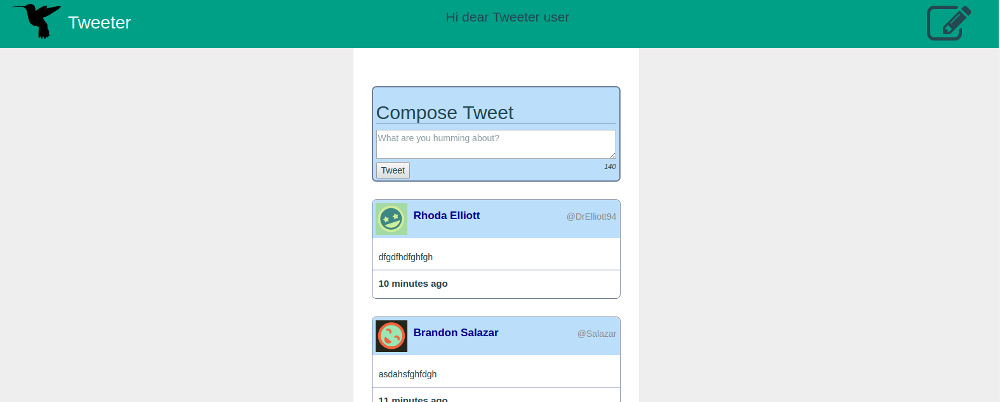
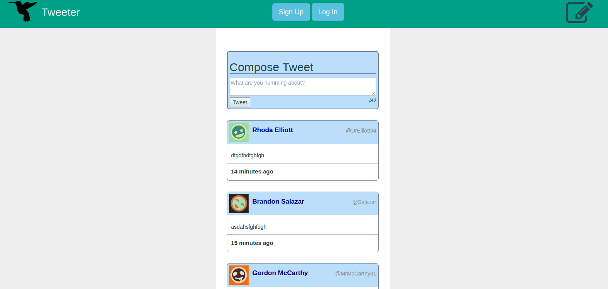

# Tweeter Project

Tweeter is a simple, single-page Twitter clone. It uses JQuery, AJAX technologies for front-end and node.js and express.js for back-end

## features
Type in a tweet and post it onto the page.

Sign up or log in to hit the like buttons or see how many likes there are for each tweet

Click the edit button top right to hide or show the compose box

## Screenshots

## Getting Started

1. Clone the package.
2. Install dependencies using the `npm install` command.
3. Start the web server using the `npm run local` command. The app will be served at <http://localhost:8080/>.
4. Go to <http://localhost:8080/> in your browser.

## Dependencies

- bcrypt
- bodyparser
- chance
- mongo db
- md5
- Express
- Node 5.10.x or above